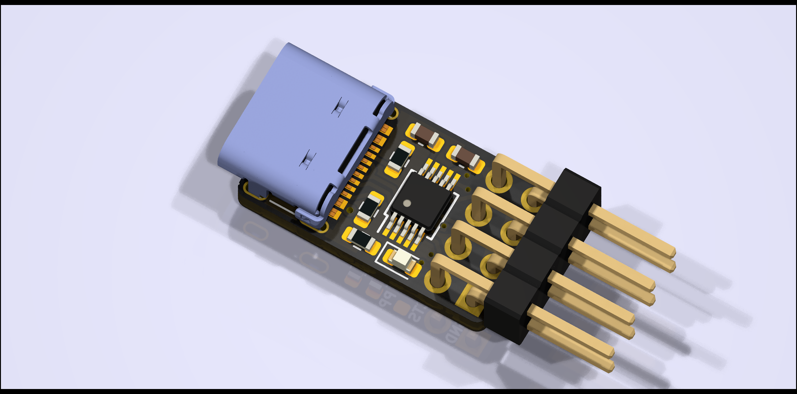
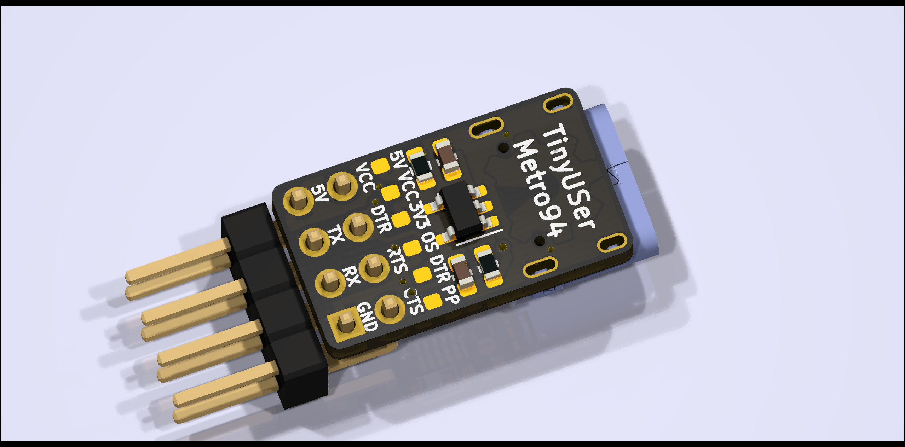

# TinyUSer - USB to Serial powered by CH340X

## Introduction

A tiny USB-to-Serial baord in just ~10x18 mm^2, powered by CH340X with *DTR#* supported.

## 3D Rendering View

## License

[CERN-OHL-P](LICENSE)

## EDA

KiCad 6.0.6

## Usages

This PCB can be used with both CH340E and CH340X. For CH340X, *TNOW* can be replaced by *DTR#*, which is useful for UART download purpose.

If 5V IO voltage level is desired, *5V* to *VCC* shall be shorten by 0Ω resistor, and *R3* shall **NOT** be connected. LDO is not required and can be left unconnected.

If 3.3V IO voltage level is desired, *3V3* to *VCC* shall be shorten by 0Ω resistor, and *R3* shall be connected. LDO is required and two 1μF capacitors should be connected.

If *DTR#* is desired, *DTR* shall be connected to *OS* (Open-Source) or *PP* (Push-Pull) by 4.7kΩ resistor, otherwise left unconnected.

### Schematics

[TinyUSer Schematic](schematics/TinyUSer.pdf)

### BOM

[TinyUSer BOM](https://metro94.github.io/TinyUSer/bom.html)

### Product Page

[USB to Serial Port Chip CH340 - NanjingQinhengMicroelectronics](http://www.wch-ic.com/products/CH340.html)
